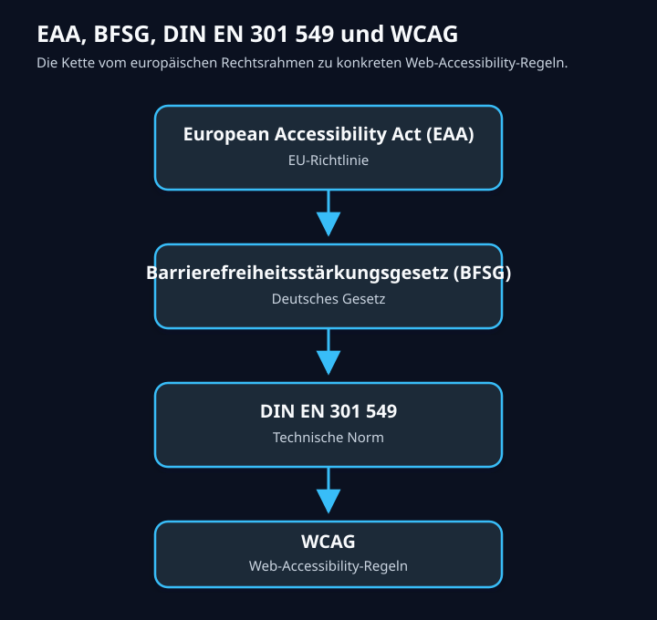

# Das Barrierefreiheitsstärkungsgesetz (BFSG)

Das Barrierefreiheitsstärkungsgesetz (BFSG) ist am 28. Juni 2025 in Kraft getreten und verpflichtet bestimmte Unternehmen in Deutschland zu mehr digitaler Barrierefreiheit.

## Was ist das BFSG?

Das Gesetz setzt den europäischen European Accessibility Act (EAA) in deutsches Recht um. Es sorgt dafür, dass bestimmte Produkte und Dienstleistungen für Menschen mit Behinderungen und ältere Menschen ohne fremde Hilfe zugänglich sind.

- Alles dazu gibt es hier: [https://bfsg-gesetz.de/](https://bfsg-gesetz.de/)
- Eine kurze Enleitung dazu gibt es hier: [https://www.youtube.com/shorts/JlZVKhXyAmg](https://www.youtube.com/shorts/JlZVKhXyAmg)

## BFSG-Betroffenheitscheck

Das Gesetz greift erst ab einer bestimmten Unternehmensgröße und nur für bestimmte Produkte und Dienstleistungen. Hat ein Unternehmen weniger als 10 Mitarbeiter oder weniger als 2 Millionen Euro Umsatz ist es mit ihren Angeboten pauschal nicht betroffen. Dazu kommen noch einige weitere Kriterien, wie zum Beispiel, ob es sich um eine B2B- oder B2C-Leistung handelt. Um zu prüfen, ob das eigene Angebot von dem Gesetz betroffen ist, kann der BFSG-Betroffenheitscheck genutzt werden:

[https://bfsg-gesetz.de/check/](https://bfsg-gesetz.de/check/)

Aber auch, wenn es nicht direkt betroffen ist, ist es sinnvoll, die Barrierefreiheit der eigenen Webanwendung zu prüfen und ggf. zu verbessern. Das erweitert die Zielgruppe und verbessert die Nutzererfahrung für alle Benutzer. Wird Barrierefreiheit von Anfang an mitgedacht, ist es auch gar nicht so aufwendig und kostengünstiger, als sie gegebenenfalls nachträglich implementieren zu müssen, wenn das Angebot oder die Firma gewachsen ist und das Gesetz dann doch greift.

## FAQ der Bundesfachstelle Barrierefreiheit

Die Bundesfachstelle Barrierefreiheit hat eine FAQ-Seite zum Barrierefreiheitsstärkungsgesetz (BFSG) veröffentlicht, die viele Fragen rund um das Gesetz beantwortet. Gut zum Nachschlagen.

[https://www.bundesfachstelle-barrierefreiheit.de/DE/Barrierefreiheitsstaerkungsgesetz/FAQ/faq_node](https://www.bundesfachstelle-barrierefreiheit.de/DE/Barrierefreiheitsstaerkungsgesetz/FAQ/faq_node)

## DIN Norm EN 301 549

Grundlage für die technische Umsetzung der Barrierefreiheit ist die [DIN Norm EN 301 549](https://www.barrierefreiheit-dienstekonsolidierung.bund.de/Webs/PB/DE/gesetze-und-richtlinien/en301549/en301549-node.html). Während das Gesetz die rechtliche Grundlage für die Barrierefreiheit schafft, beschreibt die Norm die technischen Anforderungen, die erfüllt werden müssen, damit ein Produkt oder eine Dienstleistung als barrierefrei gilt. In vielen Fällen verweist die Norm auf die Web Content Accessibility Guidelines (WCAG), die von der W3C entwickelt wurden und international als Standard für barrierefreie Webinhalte gelten.

### WCAG

Die Web [Content Accessibility Guidelines (WCAG)](https://www.w3.org/WAI/standards-guidelines/wcag/) sind ein international anerkannter Standard, der beschreibt, wie Webinhalte für Menschen mit Behinderungen zugänglich gemacht werden können. Die WCAG 2.1 und 2.2 enthalten eine Reihe von Richtlinien und Erfolgskriterien, die sicherstellen sollen, dass Webinhalte für alle Benutzer zugänglich sind.

Für die allermeisten Webanwendungen wird es reichen, sich als Frontend- bzw. Web-Entwickler bei der Arbeit auf die WCAG 2.1 und 2.2 zu konzentrieren, um die Anforderungen des BFSG zu erfüllen. Die DIN EN 301 549 verweist in vielen Fällen auf die WCAG, sodass die Einhaltung der WCAG-Richtlinien in der Regel auch die Einhaltung der Norm bedeutet.

## Kontext des Anforderungspakets

Von Copilot zusammengefasst:

**EAA** ist die europäische Grundlage.  
Der European Accessibility Act ist eine EU-Richtlinie. Er verpflichtet die EU-Mitgliedstaaten, Regeln für barrierefreie Produkte und Dienstleistungen einzuführen. Der EAA gilt also nicht einfach direkt als deutsches Alltagsgesetz für Unternehmen, sondern musste in deutsches Recht umgesetzt werden.

**BFSG** ist die deutsche Umsetzung.  
Das Barrierefreiheitsstärkungsgesetz setzt den EAA in Deutschland um. Es regelt, welche Produkte und Dienstleistungen betroffen sind, ab wann die Anforderungen gelten, welche Unternehmen ausgenommen sind und welche Marktüberwachung bzw. Sanktionen möglich sind.

**DIN EN 301 549** ist die technische Konkretisierung.  
Das BFSG sagt nicht bis ins kleinste Detail, wie ein Button, Formularfeld oder PDF technisch barrierefrei sein muss. Dafür verweist die Praxis auf technische Standards. Die EN 301 549 beschreibt Anforderungen an Barrierefreiheit von Informations- und Kommunikationstechnik, also zum Beispiel Websites, Apps, Software, Dokumente, Selbstbedienungsterminals und digitale Schnittstellen.

**WCAG** ist ein wichtiger Teil der technischen Anforderungen für Web und Apps.  
Die Web Content Accessibility Guidelines beschreiben konkrete Kriterien für barrierefreie Webinhalte: Kontraste, Tastaturbedienbarkeit, Alternativtexte, Fokus-Reihenfolge, verständliche Fehlermeldungen, semantisches HTML und so weiter. Die EN 301 549 übernimmt bzw. referenziert viele WCAG-Anforderungen für Webinhalte.

Kurzform:

- **EAA**: EU sagt: Bestimmte Produkte und Dienstleistungen müssen barrierefrei werden.
- **BFSG**: Deutschland setzt diese Pflicht rechtlich um.
- **DIN EN 301 549**: Technische Norm, die beschreibt, wie digitale Barrierefreiheit nachweisbar umgesetzt werden kann.
- **WCAG**: Konkrete Web-Regeln, die in der EN 301 549 eine zentrale Rolle spielen.

Für eine Website oder Web-App ist die praktische Kette meistens:

**Ist mein Angebot nach BFSG betroffen?**  
Wenn ja: **Welche technischen Anforderungen gelten?**  
Dann landet man sehr schnell bei **EN 301 549** und für Weboberflächen insbesondere bei **WCAG**.

## Ausnahmen

In der [FAQ](#faq-der-bundesfachstelle-barrierefreiheit) sind auch Ausnahmeregelungen für bereits entwickelte Produkte und Dienstleistungen beschrieben. Führen die Anpassungen zu unverhältnismäßigen Belastungen, zum Beispiel in Kosten oder Aufwand, oder zu einer ungewollten Wesensveränderung des Produkts oder Dienstleistung, kann eine Ausnahme beantragt werden. Die Bundesfachstelle Barrierefreiheit prüft dann, ob die Ausnahme gerechtfertigt ist. Falls ja, müssen die Produkte oder Dienstleistungen nicht barrierefrei umgestaltet werden.
